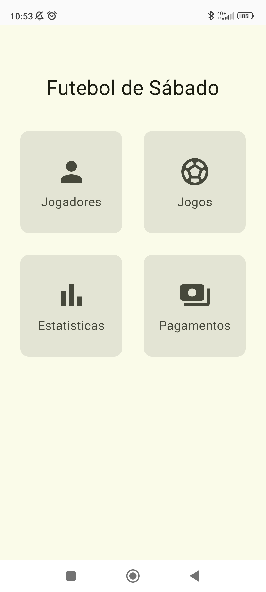
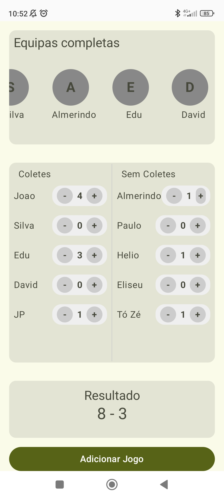
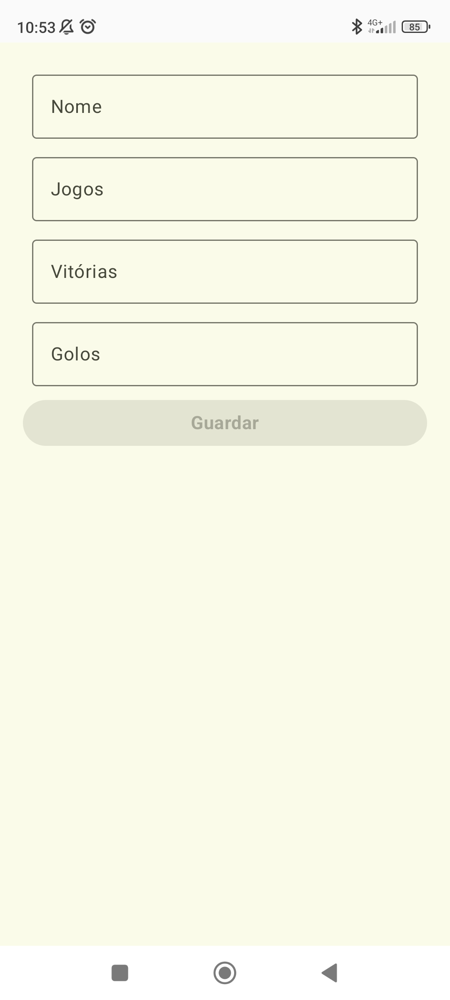
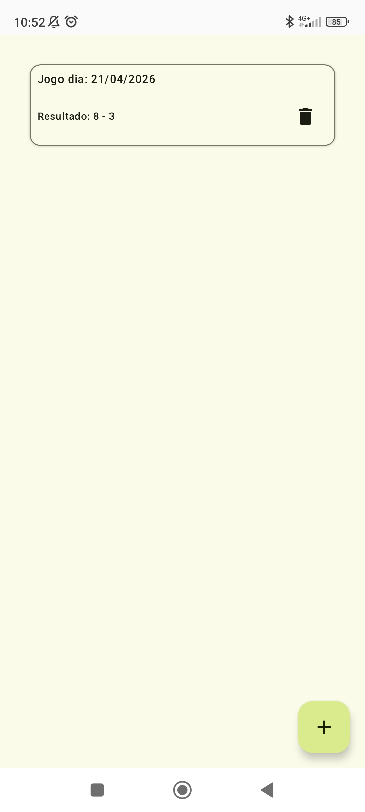
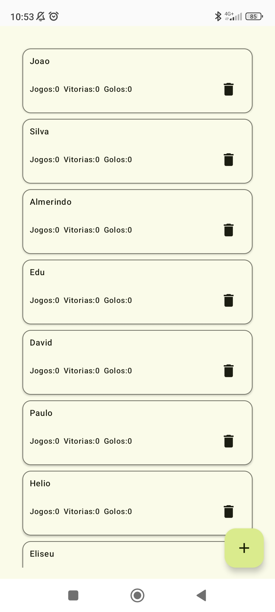
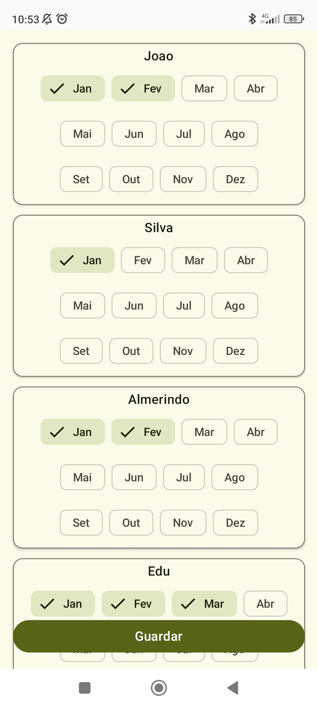

# ⚽ Football Manager App

## 📱 About
This Android application was developed to solve a real problem within a group of friends who regularly play indoor football.

Previously, match results, goals, and monthly payments were tracked manually, which often led to confusion and lack of organization.

This app centralizes all that information, allowing the responsible person to manage everything in a simple and efficient way.

---

## 🧩 Problem
- Manual tracking of matches and results
- Difficulty keeping record of goals scored by each player
- Poor control of monthly payments
- Lack of organization and visibility

---

## 💡 Solution
The app provides a structured way to:
- Manage players
- Record matches and results
- Track goals
- Control monthly payments

All in one place, with a simple and intuitive interface.

---

## 🏗️ Architecture
- MVVM (Model-View-ViewModel)
- Clean Architecture (Data, Domain, Presentation)

The project is organized to ensure scalability, maintainability, and separation of concerns.

---

## 🛠️ Tech Stack
- Kotlin
- Jetpack Compose
- Hilt (Dependency Injection)
- Room (Local Database)
- ViewModel
- Navigation Component

---

## ✨ Features
- Add and manage players
- Create and track matches
- Record goals and results
- Manage monthly payments
- View organized lists of players, games and payments

---

## 📸 Screenshots

  
  
  

  
  
  

---

## 🧠 What I Learned
- Building real-world solutions based on user needs
- Structuring Android apps using Clean Architecture
- Managing local data with Room
- Handling UI state with ViewModel
- Creating scalable and maintainable codebases

---

## 🚀 Future Improvements
- Improve UI/UX design
- Add statistics (top scorer, match history)
- Export data (CSV or PDF)
- Add authentication for multiple users
- Cloud sync (Firebase or API)

---

## 📌 Notes
This project was built with a real use case in mind and is actively used by a group of players to manage their football sessions.
